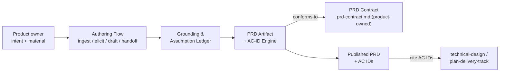

# Technical Design - define-product

How `define-product` (the tool) works: the authoring flow that turns a product owner's intent into a
contract-conformant PRD, the seams it publishes, and the gates its build must satisfy. It reconciles
to the product layer's [PRD](../product/define-product.md) and produces to the owned
[PRD / acceptance-criteria-ID contract](../product/prd-contract.md) without redefining it. Product
owns _what & why_; this design owns _how_. Where design and product intent conflict, name the
conflict rather than silently resolving it.

## 1. Planner Handoff Summary

This section is the methodology-neutral contract Planning consumes. The DDD sections below carry
deeper reasoning, but every fact Planning needs is summarized here with a stable ID and a source ref.

### Handoff Identity

| Field               | Value                            |
| ------------------- | -------------------------------- |
| Design ID           | `define-product-design`          |
| Handoff contract    | `technical-design-handoff-v0`    |
| Design title        | define-product                   |
| Status              | draft                            |
| Architecture mode   | contract/seam design             |
| Methodology profile | `ddd@1`, `use-case-slices` depth |
| Review round        | 2                                |

### Source and Product References

| ID      | Type     | Reference                                                      | Required for Planning                                                                                                                                                                          | Notes                           |
| ------- | -------- | -------------------------------------------------------------- | ---------------------------------------------------------------------------------------------------------------------------------------------------------------------------------------------- | ------------------------------- |
| SRC-001 | prd      | [`../product/define-product.md`](../product/define-product.md) | Product outcome, user job, and acceptance-criteria IDs `AC-ELICIT-001/002`, `AC-GROUND-001`, `AC-PRD-001/002`, `AC-ID-001`, `AC-CHECK-001`, `AC-TEMPLATE-001`, `AC-GUIDE-001`, `AC-SCOPE-001`. | Authoritative product contract. |
| SRC-002 | source   | [`../product/prd-contract.md`](../product/prd-contract.md)     | The owned outward seam: required PRD sections, AC-ID format, stability/supersession, citation rules. Design produces to it and must not redefine it.                                           | Cross-repo/cross-layer seam.    |
| SRC-003 | decision | This document, [§2](#2-pre-authoring-approval-record)          | Approved `InputResolution`, `AgreedSystemModel`, and `DocStructurePlan`.                                                                                                                       | Approved at the frame gate.     |
| SRC-004 | design   | v0.7 `agentic-workflow-kit:define-product` skill               | Prior-art authoring flow productized here. Reference only, not authority; not ported wholesale (SRC-001 constraint).                                                                           | Background.                     |

### Required Planning Facts

| ID       | Category             | Required handoff data                                                                                                                                                                                              | Source refs          |
| -------- | -------------------- | ------------------------------------------------------------------------------------------------------------------------------------------------------------------------------------------------------------------ | -------------------- |
| CTX-001  | Context and boundary | The **Authoring Flow** owns the elicit -> ground -> draft -> ID -> self-review -> handoff conversation; reads user-supplied material; does not own the PRD contract (product layer) or downstream layers.          | SRC-001, SRC-002     |
| CTX-002  | Context and boundary | The **PRD Contract** (`prd-contract.md`) is owned by the product layer. Design and build consume it and produce to it; changing its shape is a cross-repo event, out of this design's scope.                       | SRC-002              |
| CTX-003  | Context and boundary | Downstream (technical-design, plan-delivery-track) is reachable only through the published PRD + a next-step recommendation. define-product does not read or call downstream internals.                            | SRC-001              |
| INV-001  | Invariant            | Acceptance-criteria IDs are unique within a PRD and never reused after publication; a meaning change mints a new ID and supersedes the old, never an in-place semantic edit. Owner: AC-ID Engine.                  | SRC-002              |
| INV-002  | Invariant            | A PRD is not "complete" until every required contract section is present. Owner: PRD Artifact / validator.                                                                                                         | SRC-002, SRC-001     |
| INV-003  | Invariant            | No non-blocking unknown is left silent: each is provided, recorded as a visible assumption, or raised as a blocking question. Owner: Grounding & Assumption Ledger.                                                | SRC-001              |
| INV-004  | Invariant            | Output stays at product altitude: no architecture, packages, CLI/command behavior, schemas, or execution sequencing. Owner: Altitude Guard.                                                                        | SRC-001              |
| SURF-001 | API and surface      | Public skill entrypoint: the single invocable `define-product` authoring skill (one skill for now; may extend to a pack later — see §16).                                                                          | SRC-001, SRC-004     |
| SURF-002 | API and surface      | Package exports: a PRD template set plus a validator API (required-section check, AC-ID format + uniqueness + status/supersession integrity). The checkable core.                                                  | SRC-002              |
| SURF-003 | API and surface      | Published artifact + handoff: a contract-conformant PRD and a single next-step recommendation. This is the only outward product surface (per SRC-002 citation rules).                                              | SRC-001, SRC-002     |
| FAIL-001 | Failure              | Insufficient input for a coherent PRD -> stop with blocking questions; do not invent product facts (fail-closed on grounding).                                                                                     | SRC-001              |
| FAIL-002 | Failure              | Contract validation fails (missing section / malformed or duplicate AC ID) -> surface findings; do not silently emit a non-conformant PRD.                                                                         | SRC-002              |
| FAIL-003 | Failure              | An existing PRD is present -> resume/extend, filling only missing or thin sections; never clobber without explicit confirmation (idempotency).                                                                     | SRC-004              |
| OBS-001  | Observability        | The PRD is the durable audit record: assumptions and unresolved gaps are written into the PRD (assumptions / open-questions), so authoring decisions are recognizable without the session.                         | SRC-001 (AC-PRD-002) |
| ENF-001  | Enforcement          | Static, seeded: AC-ID validator (format + uniqueness + status vocabulary). Seeded violation: a fixture PRD with a duplicate/malformed AC ID must fail.                                                             | SURF-002, SRC-002    |
| ENF-002  | Enforcement          | Static, seeded: required-section presence check. Seeded violation: a PRD missing "Acceptance Criteria" must fail.                                                                                                  | SURF-002, SRC-002    |
| ENF-003  | Enforcement          | Manual / eval: altitude discipline (AC-SCOPE-001), blocking-only elicitation (AC-ELICIT-001), and criterion checkability substance (AC-CHECK-001) are judged by review + evals, not static rules.                  | SRC-001              |
| DEL-001  | Delivery planning    | `packages/prd-kit`: template set + AC-ID validator + required-section checker (the checkable core). Preserves AC-ID-001, AC-PRD-001, AC-TEMPLATE-001.                                                              | SURF-002             |
| DEL-002  | Delivery planning    | The single `define-product` skill implementing the use-case slices (ingest / elicit / ground / draft / self-review / handoff). Preserves AC-ELICIT-001/002, AC-GROUND-001, AC-PRD-002, AC-GUIDE-001, AC-SCOPE-001. | SURF-001, SURF-003   |
| DEL-003  | Delivery planning    | `packages/evals`: authoring-quality evals (blocking-only questioning, assumption recording, contract conformance, checkability substance). Preserves AC-ELICIT-001, AC-CHECK-001.                                  | ENF-003              |

### Sequencing, Contention, Validation, and Stops

| ID       | Category                  | Required handoff data                                                                                                                                                                                                                              | Source refs               |
| -------- | ------------------------- | -------------------------------------------------------------------------------------------------------------------------------------------------------------------------------------------------------------------------------------------------- | ------------------------- |
| SEQ-001  | Sequencing and dependency | `prd-contract.md` (product layer) is a precondition for all delivery; it is already landed. `packages/prd-kit` (templates + validator) precedes the skill that consumes them (DEL-001 before DEL-002). Evals (DEL-003) depend on a runnable skill. | SRC-002, DEL-*            |
| FILE-001 | File contention           | `docs/product/prd-contract.md` is the owned seam and lives in the **product** layer; design and build must not edit it (see STOP-001). No other shared-surface contention.                                                                         | SRC-002                   |
| VAL-001  | Validation                | `packages/prd-kit` unit tests including the ENF-001/ENF-002 seeded violations; the DEL-003 eval suite for authoring behavior; `pnpm check`. These are the gates the **build** must satisfy; today's repo gate is Prettier only (docs-only repo).   | ENF-001, ENF-002, ENF-003 |
| STOP-001 | Stop condition            | If a design or delivery decision would require changing the shape of `prd-contract.md`, stop: that is a product / cross-repo event, not part of building the tool.                                                                                 | CTX-002, SRC-002          |
| STOP-002 | Stop condition            | If supplied input is insufficient for a coherent PRD, stop and return blocking questions to the owner rather than inventing product facts.                                                                                                         | INV-003, FAIL-001         |

### Methodology-Specific Detail

- **Required handoff data:** the tables above.
- **DDD-specific authoring detail:** the context map, ubiquitous language, use-case slices, and
  invariant matrix below. Planning may read them for context but must not need to infer any handoff
  fact from them.

## 2. Pre-Authoring Approval Record

### InputResolution

**InputResolution approval status:** approved (frame gate)

| Required input                                                 | Source evidence        | Resolution        | Owner / impact                                                                                                             | Approval status |
| -------------------------------------------------------------- | ---------------------- | ----------------- | -------------------------------------------------------------------------------------------------------------------------- | --------------- |
| Product outcome, user job, acceptance criteria, non-goals      | SRC-001                | provided          | Product contract.                                                                                                          | approved        |
| Owned seam (`prd-contract.md`): sections, ID format, stability | SRC-002                | provided          | Design reconciles; must not redefine (STOP-001).                                                                           | approved        |
| Elicitation / grounding / template / ID / guidance behaviors   | SRC-001, SRC-004       | safe assumption   | Productize the v0.7 flow, reconciled to the ACs. Low risk; substance judged by evals (ENF-003).                            | approved        |
| **Concrete form** (skill vs CLI vs service vs package)         | SRC-004, sibling repos | requires approval | Changes boundaries + public surface + enforcement. **Resolved: one skill + supporting package** (D-001, refined by D-005). | approved        |
| **docs/design shape** (lean vs split)                          | sibling design layers  | requires approval | **Resolved: lean — README + technical-design.md + decisions.md** (D-003).                                                  | approved        |
| Machine-checkable scope vs manual/eval                         | SRC-002 (AC-CHECK-001) | safe assumption   | AC-ID format/uniqueness + required sections are checkable; substance stays manual/eval (non-goal).                         | approved        |

### AgreedSystemModel

**AgreedSystemModel approval status:** approved (frame gate)

| Entity                        | Responsibilities                                                                                     | Owns                                      | Reads                      | Does Not Own                                         |
| ----------------------------- | ---------------------------------------------------------------------------------------------------- | ----------------------------------------- | -------------------------- | ---------------------------------------------------- |
| Authoring Flow                | show-flow -> ingest-first -> context-rich fast path vs guided interview -> blocking-only questioning | the authoring conversation and its slices | user-supplied material     | the PRD contract; downstream layers                  |
| Grounding & Assumption Ledger | classify provided / inferred / gap / conflict; record assumptions visibly; never silently invent     | provenance + assumption/gap state         | material, elicited answers | the final section prose                              |
| PRD Artifact & Template Set   | produce the durable, standalone PRD; repeatable template covering every required section             | the produced PRD + templates              | ledger, answers            | the contract's required-section list (product-owned) |
| AC-ID Engine                  | assign stable AC IDs; check format, uniqueness, status, supersession/withdrawal; checkable shape     | AC-ID assignment + integrity              | criteria, prior IDs        | the ID format rules (defined in `prd-contract.md`)   |
| Guidance Surface              | surface why-each-section / failure-mode guidance; recommended, never gating                          | the guidance content                      | template, sections         | any blocking/gating authority                        |
| Altitude Guard                | keep output at product altitude; redirect design-altitude content                                    | the altitude boundary check               | draft content              | design/delivery decisions themselves                 |

| From             | Relation    | To                               | Notes                                                    |
| ---------------- | ----------- | -------------------------------- | -------------------------------------------------------- |
| Authoring Flow   | drives      | Grounding & Assumption Ledger    | ingest + elicited answers feed provenance classification |
| Grounding Ledger | feeds       | PRD Artifact & Template Set      | assumptions + gaps populate the PRD                      |
| PRD Artifact     | conforms to | PRD Contract (`prd-contract.md`) | produces to the seam; does not redefine it               |
| PRD Artifact     | embeds      | AC-ID Engine                     | criteria carry engine-assigned stable IDs                |
| Guidance Surface | annotates   | Authoring Flow + Template        | recommended guidance, non-gating                         |
| Altitude Guard   | constrains  | all output                       | rejects/redirects design-altitude prose                  |

### DocStructurePlan

**DocStructurePlan approval status:** approved (frame gate)

| File                  | Responsibility                                                                                           | Status       |
| --------------------- | -------------------------------------------------------------------------------------------------------- | ------------ |
| `README.md`           | Design-layer hub: what design owns, how it reconciles to product, links.                                 | overview     |
| `technical-design.md` | This document: the contract/seam design, Planner Handoff Summary, and folded-in pre-authoring approvals. | contract     |
| `decisions.md`        | Append-only decision log (frame gate + review dispositions).                                             | decision-log |

**Structure approval status:** approved. Frame provenance (InputResolution, AgreedSystemModel,
DocStructurePlan) is folded into this file rather than a separate `problem-frame.md`, matching the
lean shape approved at the gate (D-003).

## 3. Source and Context Audit

| Source                                              | Used for                                                                        | Notes                                        |
| --------------------------------------------------- | ------------------------------------------------------------------------------- | -------------------------------------------- |
| `docs/product/define-product.md` (PRD v0)           | Product outcome, user job, the ten acceptance criteria, constraints, non-goals. | Authoritative (SRC-001).                     |
| `docs/product/prd-contract.md` (v0)                 | Required sections, AC-ID format, stability/supersession, citation rules.        | Owned seam (SRC-002); design produces to it. |
| `docs/product/README.md`, `examples/minimal-prd.md` | Standalone + suite framing; a worked PRD.                                       | Supporting.                                  |
| v0.7 `agentic-workflow-kit:define-product` skill    | The real authoring mechanics being productized.                                 | Background prior art (SRC-004).              |
| Sibling `technical-design` repo                     | House target form (`skills/` + `packages/`) and design-layer shape.             | Only built sibling; precedent.               |

## 4. Assumptions and Blockers

### Safe Assumptions

- The v0.7 flow's mechanics (ingest-first, fast-path vs guided interview, blocking-only questioning,
  next-step handoff, idempotency) are the right behavior to productize; substance quality is judged by
  evals (ENF-003), not asserted here.
- The checkable core is limited to PRD _shape_ (required sections, AC-ID format/uniqueness/status);
  criterion _substance_ stays manual/eval, consistent with the non-goal "does not guarantee good
  criteria" (AC-CHECK-001).
- The design layer is documentation now; the skill and package(s) it commits to are future build
  work, consistent with the org's product -> design -> build sequencing.

### Blocking Questions

- None open. The two frame-gate `requires approval` items (concrete form; docs shape) were resolved
  at the approval gate and recorded in [`decisions.md`](./decisions.md).

## 5. Architecture Mode and DDD Depth

**Selected architecture_mode:** contract/seam design

**Selected depth:** use-case-slices

**Why this mode is the first lens:** define-product's essence _is_ a contract it produces to
(`prd-contract.md`) plus the elicitation flow that fills it. The primary design questions are seam
questions — what the tool publishes (a conformant PRD + AC-ID surface), what it consumes (owner
intent), and what it must never redefine (the owned contract). Framing it as contexts/aggregates
first would obscure that the outward surface is the point.

**Why this depth is sufficient:** the behavior is procedural — a flow of use-case slices (ingest,
elicit, ground, draft, assign/validate IDs, self-review, hand off) with clear inputs, failure tokens,
and enforceable checks. That is exactly `use-case-slices`.

**Why deeper tactical ceremony is unnecessary where omitted:** the produced artifact is a Markdown
document set, not a consistency-critical aggregate. There is no shared mutable state, no transaction
boundary, and no concurrent write model, so aggregates, value objects, domain events, and
`tactical-ddd` depth would add ceremony without a domain to guard. The one persistence-adjacent
concern — AC-ID stability across edits — is handled by an invariant (INV-001) plus the contract's
supersession rules, not by an aggregate.

## 6. Context Map

| Context                                            | Owns                                                                 | Reads                      | Does Not Own                                   |
| -------------------------------------------------- | -------------------------------------------------------------------- | -------------------------- | ---------------------------------------------- |
| Authoring Flow (the tool)                          | the elicit -> ground -> draft -> ID -> self-review -> handoff slices | user-supplied material     | the PRD contract; the downstream layers        |
| PRD Contract (`prd-contract.md`)                   | required sections, AC-ID format, stability, citation rules           | (product-layer artifact)   | anything about _how_ define-product runs       |
| Downstream (technical-design, plan-delivery-track) | reconciling their work to cited AC IDs                               | the published PRD + AC IDs | Product-layer internals; define-product's flow |

### Source-Named Internal Boundaries

| Source-named candidate | Owning context | Ownership treatment                                                                                                                                         |
| ---------------------- | -------------- | ----------------------------------------------------------------------------------------------------------------------------------------------------------- |
| AC-ID Engine           | Authoring Flow | Internal sub-boundary of the tool. It _applies_ the ID format defined in `prd-contract.md`; it does not own the format (that stays product-owned, SRC-002). |
| Assumption Ledger      | Authoring Flow | Internal sub-boundary; its output (assumptions, gaps) is materialized into the PRD, so it needs no standalone external surface.                             |

## 7. Ubiquitous Language

| Term                 | Meaning                                                                                               | Owner            |
| -------------------- | ----------------------------------------------------------------------------------------------------- | ---------------- |
| PRD                  | The durable, standalone product definition the tool produces.                                         | PRD Artifact     |
| Acceptance Criterion | A product-owned, externally recognizable success check.                                               | PRD Artifact     |
| AC ID                | The stable `AC-<TOPIC>-<NNN>` identifier a criterion carries for downstream citation.                 | AC-ID Engine     |
| Grounding            | Distinguishing owner-supplied intent, inferred assumptions, unresolved gaps, and conflicting sources. | Grounding Ledger |
| Safe assumption      | A non-blocking unknown recorded visibly in the PRD instead of interrupting the owner.                 | Grounding Ledger |
| Blocking question    | A question whose answer materially changes a coherent PRD; the only reason to interrupt.              | Authoring Flow   |
| Altitude             | The product level of the output: outcomes/jobs/criteria, not architecture/mechanics.                  | Altitude Guard   |
| Owned seam           | The published contract (`prd-contract.md`) define-product produces to and must not redefine.          | PRD Contract     |
| Handoff              | Publishing the conformant PRD plus one next-step recommendation; no downstream reads.                 | Authoring Flow   |
| Supersession         | Retiring an AC ID's meaning by minting a new ID and marking the old superseded/withdrawn.             | AC-ID Engine     |

## 8. Domain Behavior

| Command / Use Case           | Actor          | Invariant guarded                             | Result                                                        |
| ---------------------------- | -------------- | --------------------------------------------- | ------------------------------------------------------------- |
| Ingest material              | tool           | INV-003 (nothing silent)                      | source summary + pre-filled sections; gap list                |
| Elicit (blocking-only)       | tool <-> owner | AC-ELICIT-001 (ask only what blocks)          | answers, or a set of blocking questions                       |
| Ground & record assumptions  | tool           | INV-003, AC-GROUND-001 (no silent invention)  | assumption ledger: provided / inferred / gap / conflict       |
| Draft PRD                    | tool           | INV-002 (all required sections)               | a durable, standalone PRD covering every required section     |
| Assign & validate AC IDs     | tool           | INV-001 (unique, stable IDs)                  | ID'd criteria + a validation report (findings if any)         |
| Self-review + guidance       | tool           | INV-004 (altitude), AC-GUIDE-001 (non-gating) | recommended guidance surfaced; altitude violations redirected |
| Hand off                     | tool           | CTX-003 (no downstream reads)                 | published PRD + one next-step recommendation                  |
| Resume / extend (idempotent) | tool           | FAIL-003 (never clobber)                      | only missing/thin sections filled, with confirmation          |

## 9. Invariant and State Matrix

| Invariant / Predicate                                                     | Source operands                                    | Enforced by                       | Failure token                                         |
| ------------------------------------------------------------------------- | -------------------------------------------------- | --------------------------------- | ----------------------------------------------------- |
| INV-001 AC IDs unique within a PRD; never reused; meaning-change = new ID | the PRD's AC-ID set + status column                | AC-ID Engine / validator          | `duplicate-ac-id`, `reused-ac-id`, `unstable-id-edit` |
| INV-002 Every required contract section present before "complete"         | required-section set from `prd-contract.md`        | PRD Artifact / validator          | `missing-required-section`                            |
| INV-003 No non-blocking unknown left silent                               | material vs. filled sections vs. assumption ledger | Grounding & Assumption Ledger     | `silent-gap`                                          |
| INV-004 Output stays at product altitude                                  | draft content vs. altitude boundary                | Altitude Guard (manual/heuristic) | `altitude-violation`                                  |

`unstable-id-edit` and `altitude-violation` are manual/review-judged; the rest are validator-checkable
(ENF-001, ENF-002).

## 10. Ports, Adapters, and Public API

| Surface                                                 | Type               | Owner                       | Consumers                             | Enforcement                                  |
| ------------------------------------------------------- | ------------------ | --------------------------- | ------------------------------------- | -------------------------------------------- |
| SURF-001 `define-product` skill entrypoint              | public export      | Authoring Flow              | product owner (interactive)           | eval suite (ENF-003)                         |
| SURF-002 `packages/prd-kit` (templates + validator API) | public export      | AC-ID Engine / PRD Artifact | the skill; any PRD author             | unit tests + seeded violations (ENF-001/002) |
| SURF-003 published PRD + next-step recommendation       | published artifact | PRD Artifact                | technical-design, plan-delivery-track | citation rules in `prd-contract.md`          |
| upstream ingest (user material)                         | inbound adapter    | Authoring Flow              | (owner intent)                        | manual / eval                                |

**Dependency direction:** skill (SURF-001) depends on package (SURF-002); the package depends only on
conforming to `prd-contract.md` (SRC-002). Nothing here depends on downstream layers — the only
downstream coupling is the published PRD + recommendation (SURF-003), one-way.

## 11. Data, Query, and Consistency

- **Write model:** none in the transactional sense. The output is a Markdown document set; there is no
  shared mutable state, transaction boundary, or concurrent writer.
- **Read model:** the produced PRD is read directly by humans and downstream tools; AC IDs are the
  query key for citation.
- **Consistency:** the only cross-edit consistency concern is AC-ID stability (INV-001), handled by the
  contract's supersession rules plus the validator's format/uniqueness checks — not by an aggregate or
  a consistency protocol. This is why `tactical-ddd` depth is intentionally omitted (see §5).

## 12. Failure, Observability, Migration, and Deploy

- **Failure modes:** insufficient input -> stop with blocking questions, do not invent (FAIL-001);
  contract validation failure -> surface findings, do not emit a non-conformant PRD (FAIL-002);
  existing PRD present -> resume/extend, never clobber without confirmation (FAIL-003). All are
  fail-closed toward the owner's visibility.
- **Observability:** the PRD itself is the durable audit record (OBS-001). Assumptions, unresolved
  gaps, and conflicts are written into the PRD so the authoring decisions are recognizable without the
  session that produced them (AC-PRD-002).
- **Migration/deploy:** no legacy migration (non-goal). "Deploy" is publishing the skill to the
  plugin marketplace and the package(s) to the workspace/npm — future build work. The v0.7 skill is
  prior art, not migrated wholesale (SRC-001 constraint).

## 13. Diagrams

The skeleton below traces only approved entities and the approved seams. It introduces no
architecture absent from §2.

## 14. Testing and Enforcement

| Claim                                                                                     | Proof                                                                        | Standing gate                             |
| ----------------------------------------------------------------------------------------- | ---------------------------------------------------------------------------- | ----------------------------------------- |
| ENF-001 AC-ID format + uniqueness + status vocabulary enforced                            | validator unit tests; seeded fixture with a duplicate/malformed ID must fail | `packages/prd-kit` tests via `pnpm check` |
| ENF-002 Required-section presence enforced                                                | validator unit tests; seeded fixture missing "Acceptance Criteria" must fail | `packages/prd-kit` tests via `pnpm check` |
| ENF-003 Blocking-only elicitation, assumption recording, checkability substance, altitude | authoring-quality evals + human review                                       | `packages/evals` suite (manual/eval)      |

The enforcement map states the gates the **build** must satisfy. Today the repo is docs-only and its
gate is Prettier formatting only (per `AGENTS.md`); the validator, tests, and evals are future
delivery (DEL-001..DEL-003). Every enforceable boundary above names a seeded violation; the
non-static rules (ENF-003) are explicitly called out as eval/manual, consistent with the non-goal of
guaranteeing criterion substance.

## 15. Delivery Inputs

- **Candidate story areas:** DEL-001 `packages/prd-kit` (templates + AC-ID validator + required-section
  checker); DEL-002 the single `define-product` skill implementing the use-case slices; DEL-003
  `packages/evals` authoring-quality evals.
- **Sequencing constraints:** SEQ-001 — `prd-contract.md` (landed) precedes all; `prd-kit` before the
  skill that consumes it; evals after a runnable skill.
- **File contention:** FILE-001 — `docs/product/prd-contract.md` is product-owned; do not edit it in
  design/build (STOP-001). No other shared-surface contention.
- **Validation expectations:** VAL-001 — `prd-kit` unit tests incl. ENF-001/ENF-002 seeded violations;
  the DEL-003 eval suite; `pnpm check`.
- **Stop conditions:** STOP-001 — any decision that would reshape `prd-contract.md` returns to the
  product / cross-repo layer; STOP-002 — insufficient input returns blocking questions to the owner.

## 16. Risks and Deferred Decisions

- **Ships as one skill for now (D-005).** The flow is one `define-product` skill. Future product
  operations — roadmap authoring, delivery-phase / MVP prioritization, and similar — may extend it
  into a pack later; that is out of scope now. The use-case slices in §8 are the grouping, and the
  outward surfaces (§10) hold either way.
- **Checkability substance is bounded by design.** ENF-001/002 check PRD _shape_ only; criterion
  _substance_ (AC-CHECK-001) is eval/manual — a careless author can still write a criterion that
  passes vacuously. This is an accepted tradeoff carried from the product non-goals.
- **Package naming (`prd-kit`) is illustrative**, mirroring the sibling `eval-kit`/`evals` shape; the
  final name is a build-time decision and not a handoff fact.
- **Eval calibration is future work.** DEL-003's authoring-quality judges need calibration before they
  can gate; until then ENF-003 is manual review.
